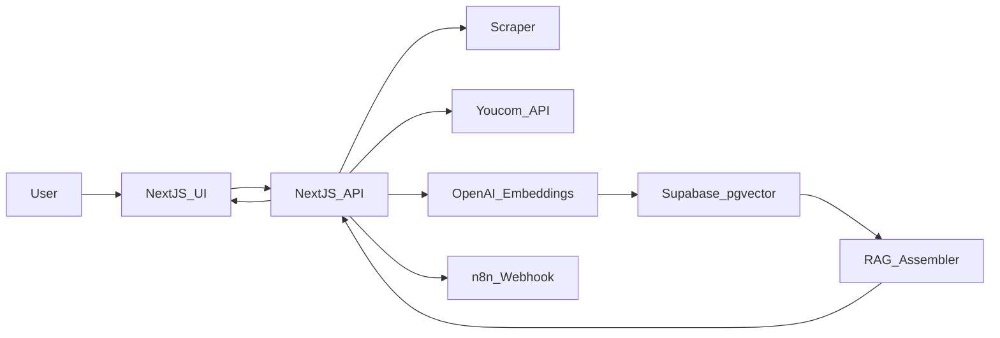

# You.com ABM Agent

A Next.js 15 dashboard that generates personalized Account-Based Marketing (ABM) insights by scraping company basics, using You.com APIs for live cited research, running RAG (Retrieval-Augmented Generation) with OpenAI embeddings on Supabase pgvector, and triggering n8n for automated outreach.

## Architecture



## Tech Stack

- **Frontend/Backend**: Next.js 16 (App Router)
- **RAG/Vector DB**: LangChain.js + Supabase (PostgreSQL with pgvector)
- **Scraping**: Cheerio + Axios
- **Search/Citations**: You.com Search/Express APIs
- **LLM/Embeddings**: OpenAI (GPT-4o-mini, text-embedding-3-small)
- **Automation**: n8n webhook for email outreach
- **Deployment**: Vercel (recommended)

## Prerequisites

- Node.js 18+ and npm
- You.com API key ([get one here](https://api.you.com))
- OpenAI API key
- Supabase account (free tier works)

## Setup

### 1. Install Dependencies

```bash
npm install
```

### 2. Environment Variables

Create a `.env.local` file in the root directory:

```env
# You.com API Key
YOU_API_KEY=ydc-sk-your-key-here

# OpenAI API Key for embeddings and LLM
OPENAI_API_KEY=sk-your-key-here

# Supabase Configuration
SUPABASE_URL=https://your-project.supabase.co
SUPABASE_SERVICE_ROLE_KEY=your-service-role-key

# n8n Webhook URL (optional)
N8N_WEBHOOK_URL=https://your-n8n-instance.com/webhook/abm
```

### 3. Supabase Database Setup

1. Create a new Supabase project at [supabase.com](https://supabase.com)
2. Enable the `pgvector` extension in your database:
   - Go to SQL Editor in Supabase dashboard
   - Run: `CREATE EXTENSION IF NOT EXISTS vector;`

3. Create the required tables:

```sql
-- Table for ABM runs
CREATE TABLE abm_runs (
  id UUID PRIMARY KEY DEFAULT gen_random_uuid(),
  company TEXT NOT NULL,
  domain TEXT NOT NULL,
  status TEXT NOT NULL DEFAULT 'processing',
  result_json JSONB,
  created_at TIMESTAMP WITH TIME ZONE DEFAULT NOW()
);

-- Table for storing embeddings and insights
CREATE TABLE abm_insights (
  id UUID PRIMARY KEY DEFAULT gen_random_uuid(),
  run_id UUID NOT NULL REFERENCES abm_runs(id) ON DELETE CASCADE,
  content_json JSONB NOT NULL,
  embedding vector(1536) NOT NULL,
  citations JSONB DEFAULT '[]'::jsonb,
  created_at TIMESTAMP WITH TIME ZONE DEFAULT NOW()
);

-- Index for vector similarity search
CREATE INDEX ON abm_insights USING ivfflat (embedding vector_cosine_ops);

-- Optional: RPC function for similarity search (more efficient)
CREATE OR REPLACE FUNCTION match_abm_insights(
  query_embedding vector(1536),
  match_threshold float,
  match_count int,
  run_id uuid
)
RETURNS TABLE (
  id uuid,
  content_json jsonb,
  citations jsonb,
  similarity float
)
LANGUAGE plpgsql
AS $$
BEGIN
  RETURN QUERY
  SELECT
    abm_insights.id,
    abm_insights.content_json,
    abm_insights.citations,
    1 - (abm_insights.embedding <=> query_embedding) AS similarity
  FROM abm_insights
  WHERE abm_insights.run_id = match_abm_insights.run_id
    AND 1 - (abm_insights.embedding <=> query_embedding) > match_threshold
  ORDER BY abm_insights.embedding <=> query_embedding
  LIMIT match_count;
END;
$$;
```

### 4. Run Development Server

```bash
npm run dev
```

Open [http://localhost:3000](http://localhost:3000) in your browser.

## Usage

1. Enter a company name and domain on the home page
2. Optionally enable "Send outreach via n8n webhook"
3. Click "Generate ABM Insights"
4. View the results page with:
   - Key insights about the company
   - Personalized email subject and body
   - Citations and sources
   - Scraped company information

## API Endpoints

### POST `/api/abm`

Generate ABM insights for a company.

**Request Body:**
```json
{
  "company": "StratNova",
  "domain": "stratnova.com",
  "send_via_n8n": false
}
```

**Response:**
```json
{
  "success": true,
  "run_id": "uuid",
  "company": "StratNova",
  "domain": "stratnova.com",
  "insights": {
    "insights": ["insight 1", "insight 2"],
    "email_subject": "Subject line",
    "email_body": "Email body",
    "citations": ["url1", "url2"]
  },
  "scraped_data": {...},
  "you_com_citations": 5
}
```

### GET `/api/abm?run_id=<uuid>`

Retrieve results for a specific run.

## n8n Integration

The app can trigger n8n webhooks for automated email outreach. When `send_via_n8n` is true, the API sends a POST request to your n8n webhook URL with:

```json
{
  "company": "Company Name",
  "domain": "company.com",
  "email_subject": "Subject",
  "email_body": "Body",
  "insights": [...],
  "citations": [...],
  "run_id": "uuid"
}
```

### n8n Workflow Setup

1. Create a new workflow in n8n
2. Add a Webhook node (POST method)
3. Add an AI Agent node (optional - to refine the email)
4. Add an Email node (Resend/SendGrid)
5. Add a Slack/Notification node (optional)
6. Copy the webhook URL to `N8N_WEBHOOK_URL` in `.env.local`

## Deployment

### Vercel (Recommended)

1. Push your code to GitHub
2. Import the project in [Vercel](https://vercel.com)
3. Add all environment variables in Vercel dashboard
4. Deploy!

```bash
# Or use Vercel CLI
npm i -g vercel
vercel --prod
```

### Environment Variables on Vercel

Make sure to add all variables from `.env.local` in the Vercel project settings.

## Project Structure

```
abm-agent/
├── app/
│   ├── api/
│   │   └── abm/
│   │       └── route.ts          # API route handler
│   ├── abm/
│   │   └── [company]/
│   │       └── page.tsx          # Results page
│   ├── page.tsx                  # Home/dashboard page
│   ├── layout.tsx                # Root layout
│   └── globals.css               # Global styles
├── lib/
│   ├── env.ts                    # Environment validation
│   ├── scraper.ts                # Company scraping module
│   ├── youcom.ts                 # You.com API client
│   ├── rag.ts                    # RAG pipeline
│   └── prompts.ts                # LLM prompts
└── README.md
```

## Features

- ✅ Company website scraping with Cheerio
- ✅ You.com API integration for cited research
- ✅ RAG pipeline with OpenAI embeddings
- ✅ Vector similarity search with Supabase pgvector
- ✅ Personalized email generation
- ✅ n8n webhook integration
- ✅ Modern Next.js 16 UI with Tailwind CSS
- ✅ Error handling and fallbacks

## Troubleshooting

### "Failed to create run record"
- Check Supabase connection and credentials
- Ensure tables are created correctly

### "You.com API error"
- Verify `YOU_API_KEY` is correct
- Check API rate limits

### "Error creating embeddings"
- Verify `OPENAI_API_KEY` is correct
- Check OpenAI API quota

### Vector search not working
- Ensure pgvector extension is enabled
- Check that embeddings are 1536 dimensions (text-embedding-3-small)

## License

MIT

## Acknowledgments

- [You.com API](https://docs.you.com)
- [Supabase](https://supabase.com)
- [OpenAI](https://openai.com)
- [n8n](https://n8n.io)
